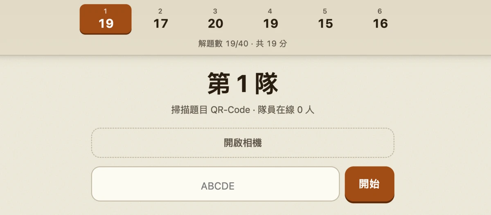

<div align="center">

<h1>校園尋寶</h1>

[](https://www.python.org)
[](https://flask.palletsprojects.com)
[](LICENSE)

**繁體中文** | [English](README-en.md)

</div>

## 總覽



臺科資工校園尋寶活動的前後端。找到藏在校園中的 QR-Code，並與隊輔和組員一起解開謎題

### 規則

- 隊輔是中立的裁決角色，可以掃描題目、終止作答，並於同票時與組員討論得出最終共識
- 每隊一題只能提交一次
- 僅組員可以投票

<br clear="right"/>

## 快速開始

### 需求

- Python 3.14 以上
- [uv](https://docs.astral.sh/uv/)
- Node（僅跑前端測試時需要）

### 跑起來

```bash
git clone https://github.com/xinshoutw/campus-treasure.git
cd campus-treasure

uv sync
uv run src/main.py
```

1. 驗證 `.env`（Token 唯一性）
2. 驗證 `questions.yaml`（id 格式與唯一性、answer 必須在 choices 裡、選項 2-10 個、points 為正數、欄位名稱無誤）
3. 將 `image` 的遠端圖片快取保存到 `static/cache/`

<br/>

## 設定

`.env`：

| 欄位 | 說明                                                  |
|---|-------------------------------------------------------|
| `MEMBER_KEY` | **隊員** token，以 `;` 分隔，數量與 `LEADER_KEY` 一致 |
| `LEADER_KEY` | **隊輔** token，以 `;` 分隔，數量與 `MEMBER_KEY` 一致 |
| `RANDOM_CHOICES` | 是否隨機選項順序                                      |
| `SHOW_SCORES_IN_MENU` | 是否公開顯示各隊分數                                  |
| `RESET_TOKEN` | 重設遊戲。**留空則停用**                              |
| `HOST` / `PORT` | 監聽位址                                              |
| `SITE_URL` | `make_qr.py` 產生登入 QR 的域名                       |

`questions.yaml` 的欄位說明寫在檔案開頭。

<br/>

## 產生 QR-Code

```bash
uv run src/make_qr.py      # 一個 QR 一張 PNG
uv run src/make_qr.py --pdf # A4 多頁 PDF，每頁 2x4 共 8 個，含裁切線
```

輸出到 `qr/`：

| 檔名 | 用途                   | 紙上標籤   |
|---|------------------------|------------|
| `leader_1.png` … `leader_6.png` | **隊輔**登入           | `LEADER n` |
| `member_1.png` … `member_6.png` | **隊員**登入           | `TEAM n`   |
| `ABCDE.png` … | 尋寶題目，五位英文代碼 | ABCDE      |
| `qrcodes.pdf` | `--pdf` 的輸出，向量圖 | —          |

<br/>

## 測試

```bash
uv run tests/test_main.py    # 後端
node tests/test_web.cjs      # 前端
```

<br/>

## 技術棧

| 項目 | 選用                                         |
|---|----------------------------------------------|
| 後端 | Flask 3 ＋ waitress，單 process、8 執行緒    |
| 前端 | 原生 JS                                      |
| 狀態 | 進行中的投票在記憶體；提交結果在 `data.json` |
| QR 解碼 | vendored jsQR                                |
| QR 產生 | segno ＋ fpdf2                               |
| 套件管理 | uv                                           |

### 專案結構

```
src/main.py                設定與題庫驗證、狀態機、API、data.json 讀寫
src/make_qr.py             產生登入與題目 QR（PNG 或 A4 PDF）
src/templates/index.html   單頁 HTML，四種畫面都在裡面用 hidden 切換
src/static/app.js          前端：登入、相機、輪詢、投票、送出
src/static/style.css       設計 token 與版面
src/static/jsQR.js         vendored QR 解碼器，已 minify
src/static/cache/          啟動時下載的題目圖片（gitignore）
tests/test_main.py         後端測試
tests/test_web.cjs         前端端到端測試
questions.yaml             題庫，欄位說明在檔案開頭
qr/                        make_qr.py 的輸出（gitignore）
data.json                  作答紀錄，執行期產生（gitignore）
```

<br/>

## 重置遊戲

```bash
curl -X POST https://treasure.ntust.org/reset -H "X-Reset-Token: $RESET_TOKEN"
```

將自動備份 `data.json` 於同目錄，並清除所有隊伍的分數與作答紀錄

<br/>

## 貢獻

送 PR 之前：

1. `uv run tests/test_main.py` 與 `node tests/test_web.cjs` 通過
2. commit 遵循 [Conventional Commits](https://www.conventionalcommits.org/zh-hant/v1.0.0/)
3. 以 `feat/your-feature` 或 `fix/your-fix` 命名分支
4. 不使用 Emoji

<br/>

## 授權

Copyright (C) 2026 xinshoutw

本專案採用 **GNU Affero General Public License v3.0 或更新版本** 授權，完整條款見 [LICENSE](LICENSE)

<br/>

## 免責聲明

本專案與國立臺灣科技大學無官方關聯。
